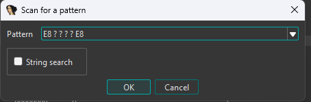

# libhat-ida
An [IDA Pro](https://hex-rays.com/ida-pro) pattern scanner plugin powered by [Libhat](https://github.com/BasedInc/libhat).

## Usage

1. Download latest release dll (or source for compilation) for preferred ida version from [releases](https://github.com/h-arvs/libhat-ida/releases)
2. Move dll file into YOUR_IDA_DIRECTORY/plugins
3. Load any binary
4. Use default hotkey Alt+B to run libhat-ida or run via Edit -> Plugins -> Libhat
5. Enter an ida style byte pattern in the libhat-ida GUI and press OK to execute a scan
### 

- Alternatively, check the String search checkbox to perform a (case sensitive) scan of the entered string

6. Once a scan is completed a dockable IDA Sequence of bytes result style window will be shown, listing all yielded results
### 
7. Double click any result to jump to it's respective address

## License

This work is under the [Creative Commons Attribution-NonCommercial 4.0 International License.](https://creativecommons.org/licenses/by-nc/4.0/)